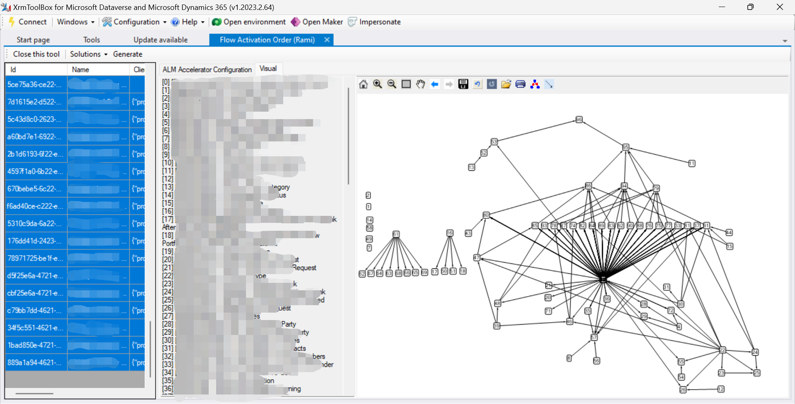

# Flow Activation Order
A plugin for XrmToolBox that gives valid activation order for flows in a solution, taking into account the dependency among the flows (parent/child relationships ).

### Features
- List all the flows based on a selected solution and their properties.
- Generate an ordered list of flows that can be activated in one pass, without errors or conflicts. This is useful for large projects with many flows and complex parent-child relationships.
- Generate a visual graph that shows the dependencies between flows. This can help developers understand the impact of changes and track the effects of modifying a flow.
- Generate a list of flow configurations that can be used with ALM Accelerator for Power Platform. This can help developers resolve issues with flows activation and improve overall CI/CD automation.

### How to use the tool
1. Connect to your organization environment.
2. From the ***Solutions*** menu, choose your solution.
3. All the flows in the selected solution will be listed in the table on the left side. Select the flows you want to analyze their parent-child relationships.
4. Click the ***Generate*** button.
5. On the right section,
	- ***ALM Accelerator Configuration*** tab shows a JSON-like text that you can copy and paste in the [ALM Accelerator for Power Platform Administration](https://learn.microsoft.com/en-us/power-platform/guidance/alm-accelerator/overview "ALM Accelerator for Power Platform Administration") App (User Setting -> Data field)
	- ***Visual*** tab displays a graphical representation of the relationships between the selected flows.

###Example

